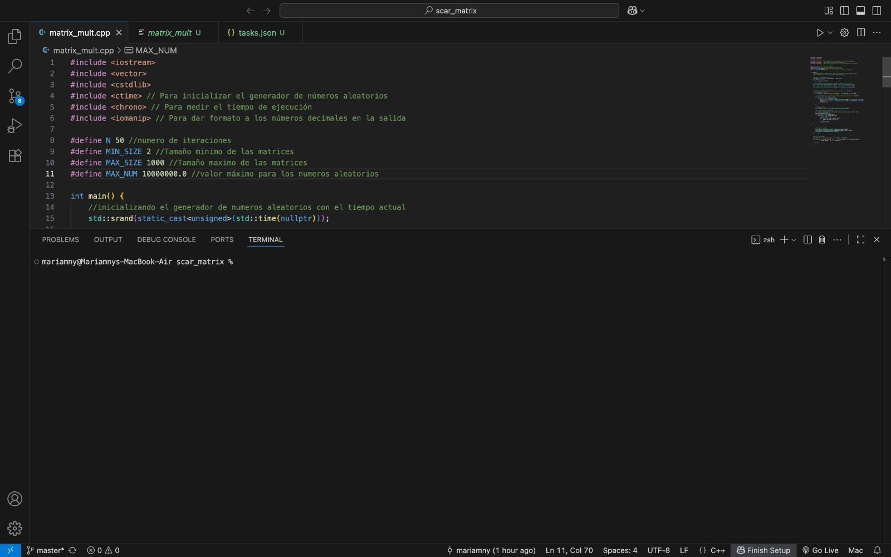
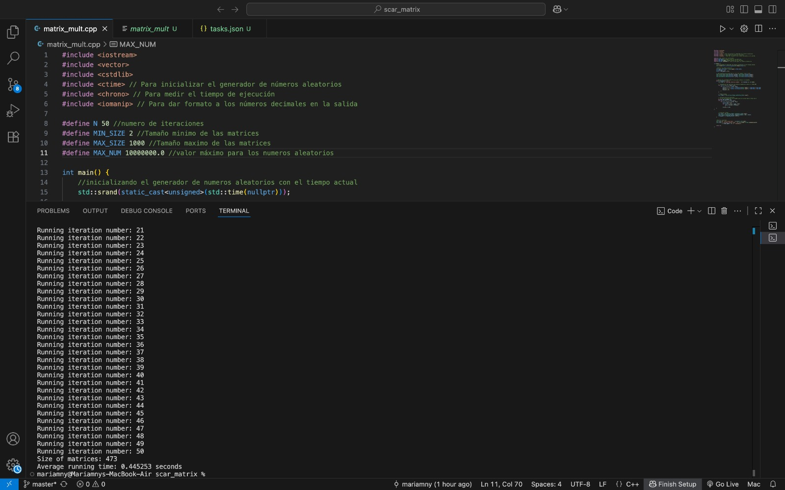

# Matrix Multiplication with OpenMP – SCAR Final Workshop

This workshop contains a C++ implementation of matrix multiplication using **OpenMP** for parallelism, developed to optimize the execution of a matrix operation..

---

##  General Information

* **Student:** Mariamny del Valle Ramírez Telles
* **Career:** Systems Engineering
* **Semester:** 4˚ semestre

---

## 💡 Descripción del Proyecto

The program performs the multiplication of two randomly generated square matrices using **parallel computing with OpenMP** to improve performance. The operation runs for **50 iterations**, and the **average execution time** is printed upon completion.

This type of parallelization is especially useful for large matrices, as it significantly reduces the total execution time.

---

##  Compilation

We need to make sure we have an OpenMP-compatible compiler like `g++`. Then run:

```bash
g++ -fopenmp matrix_mult.cpp -o matrix_mult
```

---

##  Execution

After compiling, the program should be run like this:

```bash
./matrix_mult
```

The output will look something like this:

```
Running iteration number: 1
...
Running iteration number: 50
Size of matrices: 473
Average running time: 0.45253 seconds
```

>  The size of the matrix varies with each run, as it is randomly generated.

---

##  Method Used

**OpenMP** was used to parallelize the nested loops that traverse the arrays:

```cpp
#pragma omp parallel for
for (int i = 0; i < size; i++) {
    for (int j = 0; j < size; j++) {
        for (int k = 0; k < size; k++) {
            C[i][j] += A[i][k] * B_T[j][k];
        }
    }
}
```

The `#pragma omp parallel for` directive allows the rows of the resulting matrix to be calculated in parallel, distributing the workload among multiple processor threads.

---

##  Results

###  Initial Time



###  Final Time with OpenMP




---


🚀 Final project submitted to SCAR
